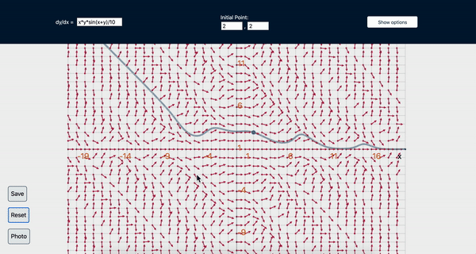

# Direction field grapher

Graphs the direction field of a first order differential equation.

https://www.maths.usyd.edu.au/u/jburke/directionFieldGrapher

## Features

- 3d view: the more vertical an arrow is, the more it is displaced in the z-direction. To see this, rotate the camera by holding shift while dragging the mouse, or or using two fingers on a touch screen (to move the display without rotating, use normal click and drag, or one finger on touch screen; to zoom in/out use pinch on a track pad or touch screen)



- everything is adjustable and customizable using the Options menu


- save the entire state of the app in the query string of the address (no server required); user can copy the new address, and e.g., send it to students, or post it on course webpages; also allows creation of easy defaults; once saved, the back button changes the app to the previously saved state.

- the initial point on the solution curve is draggable


## Implementation details

The raw ingredients are React, ThreeJS, and jotai, with Tailwind for styling
and Reakit for an accessible modal. 

The program is structured as follows:

The entire page and program is a single React component named App,
with the following structure, which is explained further below:
```javascript
function App() {
    return (
        <JotaiProvider>
                <header>
		    <DiffEqInput />
                    <InitialPointInput />
		    <OptionsModal />
                </header>

                <main>
                    <ThreeSceneComp>
                        <Axes2D/>
                        <Grid/>
                        <ArrowGrid/>
                        <IntegralCurve/>
                        <CameraControls/>
                    </ThreeSceneComp>
                    <DataComp/>
                </main>
        </JotaiProvider>
    );
}
```

Jotai is an 'atomic state' library. Its significance is explained
below.

Inside the header are the two input components and a button that
toggles a modal tabular component, with various options related to the
scene.

The html element returned by ThreeSceneComp is the canvas element that
ThreeJS draws into. The state of ThreeSceneComp is a single object,
called ThreeCBs. It's initialized with a call to
ThreeSceneFactory. This is a factory function that returns an object
with methods to manipulate a ThreeJS scene, camera, renderer,
etc. that are stored in the function closure. ThreeSceneComp passes
ThreeCBs to all of its children as a prop.

The children of ThreeSceneComp define what is shown in the ThreeJS
 scene in the browser. They are all abstract components (they return
 null).  They receive ThreeCBs as a prop, and use it to, e.g., add or
 remove meshes from the scene in effects depending on various state
 (meshes are things that can be seen by the viewer).
  
Before describing DataComp, it will be helpful to briefly describe
how state is managed. Usual React state does not work well for this
app. To see why, consider the initial point state. This is an
array of two numbers and is used by InitialPointInput in
the header, and IntegralCurve in ThreeSceneComp. By usual React
conventions, the initial point state should be lifted up to the App
component, the lowest common ancestor of InitialPointInput and
IntegralCurve. However, we really don't want everything in
ThreeSceneComp to have to rerender when the initial point changes
(especially when it's being dragged and changing rapidly). Worse case,
the scene will be created and destroyed each render, which will
involve moving thousands of vertices on and off the GPU. Such a program
would be incredibly slow and frustrating to use.

Jotai solves this state management problem. It sets up a second
state tree that is independent of the usual React state tree. The
objects that hold jotai state are called atoms, and components can use
atoms to subscribe to jotai state. For instance, we have a
initialPointAtom that both InitialPointInput and IntegralCurve are
passed as props. They are the only subscribers to this atom, and only
these components (and any possible children) are called when the
initial point changes. 

All of the atoms used by the program are created in atoms.ts, and
exported to App, which doles them out to components as needed. 

DataComp is created in the atom.ts file, and has access to all of the
atoms in the app. DataComp returns as html element a div with two
buttons, Save and Reset. The Save button writes the current state of
all the atoms (all the global state of the app) into the query string
of address, and reset sets all atoms to their defaults. DataComp is also
responsible for changing atom values when the page is loaded with a
query string.
